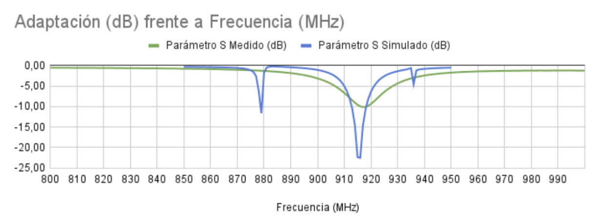
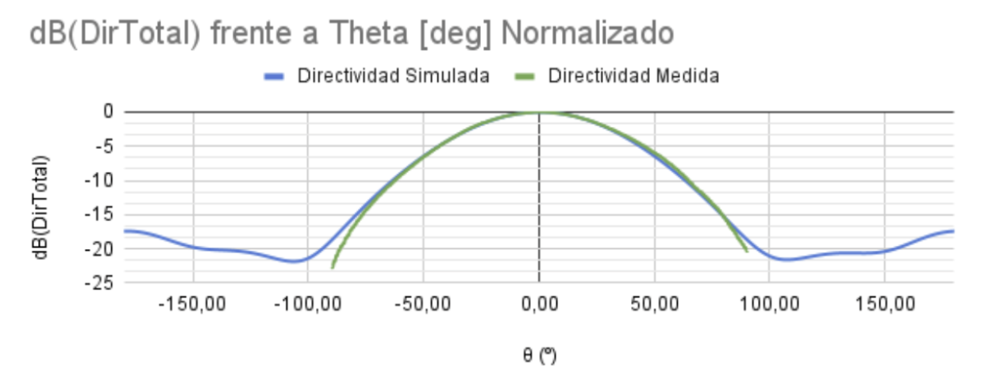

# Fabricación de una antena hecha a mano

**Autores:**  
- Guillermo Aix García¹  
- Miguel Cox Caballero¹  
- Gonzalo Déquer Martínez¹  
- Jorge García Doménech¹  
- Celso Molina Ibáñez¹  
- María Mercedes Campo Valera²  
- David Cañete Rebenaque²  
- Jose Luis Gomez Tornero²  

¹ IES Juan Carlos I  
² Universidad Politécnica de Cartagena  

---

## Introducción / Objetivos

Se construyó una antena con el objetivo de estudiar su comportamiento, comenzando con la simulación de un prototipo a través de cálculos basados en ecuaciones. Se identificaron áreas de mejora, como la creación de un inset para ajustar la frecuencia de resonancia de la antena y así conseguir que esta sea más eficiente. Posteriormente, se construyó la antena siguiendo el diseño del prototipo y se sometió a pruebas para verificar la correspondencia de la frecuencia simulada con la obtenida en la realidad. Los resultados fueron satisfactorios, por lo que se testó en la cámara anecoica de la UPCT.

## Método Teórico

- Uso de fórmulas simples para obtener parámetros aproximados y establecer un diseño inicial de la antena.  
- Selección de una frecuencia de 915 MHz (banda UHF americana) como referencia, para asegurar margen en caso de errores de montaje.  
- Elección del sustrato FR4 por su bajo costo, con:
  - Constante dieléctrica (εr): 4,8  
  - Grosor: 1,6 mm  
- Cálculo manual de las medidas necesarias, verificado posteriormente con una calculadora en línea.

## Método Numérico

1. Diseño básico obtenido con el método teórico.  
2. Simulación digital en Ansys HFSS para identificar mejoras:
   - Necesidad de un inset para mejorar la adaptación (inicialmente pobre, –2 dB).  
3. Modificación del diseño:
   - Adaptación mejorada a –20 dB en condiciones ideales.  
4. Segunda simulación con cambios aplicados.

## Método Experimental

- Fabricación de la antena según las especificaciones de la simulación.  
- Medición de:
  - Frecuencia de irradiación (918 MHz).  
  - Adaptación de la antena (–10 dB).  
- Pruebas en la cámara anecoica de la UPCT:
  - Recopilación de datos de directividad.  
  - Comparación con resultados de simulación, confirmando funcionamiento real a pesar de pérdidas de eficiencia.

## Resultados / Conclusiones

### Adaptación (dB) frente a Frecuencia (MHz)  

Se observa que la frecuencia medida coincide con la simulada, aunque es bastante menos potente en condiciones reales.

### dB(DirTotal) frente a Theta [deg] Normalizado  

La directividad medida en la cámara es muy similar a la simulada una vez está normalizada, por lo que se comprueba la correcta fabricación de la antena.  
